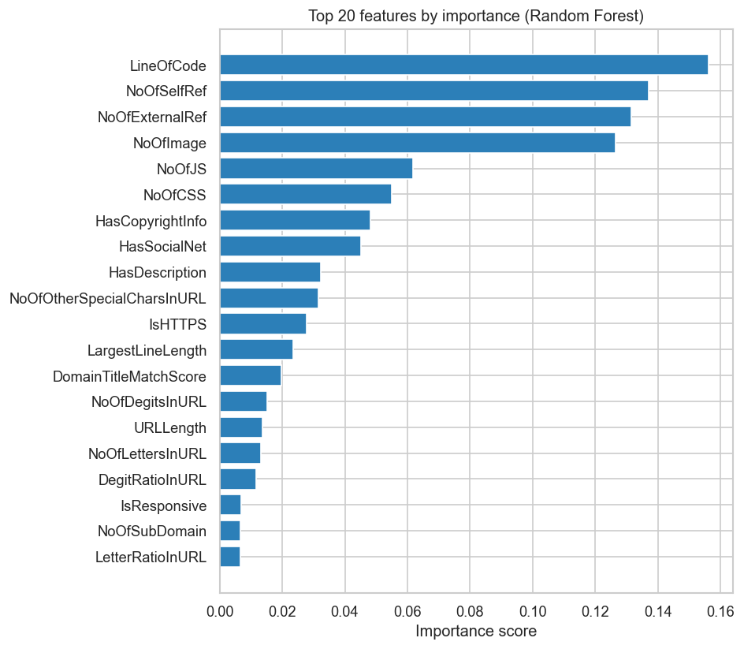

# Phishing URL Detector

A machine learning tool that classifies URLs as phishing or legitimate using
a Random Forest classifier trained on a 235K-URL public dataset. Includes a
packaged CLI with single-URL and batch prediction, feature-level explanations,
and a 38-test pytest suite.

```bash
$ phishing-detector predict "https://github.com"

URL: https://github.com
Prediction: LEGITIMATE  (confidence: XX.X%)
  Probability legit: XX.X%   phishing: XX.X%
```

## Results

Trained on the [PhiUSIIL Phishing URL Dataset](https://archive.ics.uci.edu/dataset/967/phiusiil+phishing+url+dataset)
(~235K URLs, 54 features). Final model uses only the subset of features that
can be extracted from a raw URL string at prediction time — see the
[methodology writeup](docs/writeup.md) for why this matters.

| Metric | Test set |
|---|---|
| Accuracy | 99.50% |
| Precision | 99.24% |
| Recall | 99.89% |
| F1 score | 99.56% |
| ROC AUC | 0.9973 |

Test set: ~47,000 held-out URLs, stratified 80/20 split, `random_state=42`.

### What the model looks at



Top predictive features turned out to be URL length, digit ratio, and number
of subdomains — consistent with the intuition that phishing URLs tend to be
longer, contain more digits (encoded parameters or IP-like substitutions), and
pad legitimate-looking brands behind multiple subdomains (e.g.
`paypal.security.login.malicious.com`).

## Quickstart

```bash
# Clone and install
git clone https://github.com/cdowning2022/phishing-url-detector.git
cd phishing-url-detector
python -m venv venv
source venv/bin/activate              # Windows: venv\Scripts\activate
pip install -e .

# Download the dataset (one-time setup)
# Get the CSV from the UCI link above and place it in data/
# as PhiUSIIL_Phishing_URL_Dataset.csv

# Train the model
python -m src.train

# Classify a URL
phishing-detector predict "https://github.com"

# Classify a batch from a file
phishing-detector predict-batch urls.txt -o results.csv

# See model metadata
phishing-detector info
```

## Commands

| Command | What it does |
|---|---|
| `phishing-detector predict <url>` | Classify a single URL |
| `phishing-detector predict <url> --verbose` | Plus top contributing features |
| `phishing-detector predict-batch <file>` | Classify every URL in a file |
| `phishing-detector predict-batch <file> -o results.csv` | Same, but save to CSV |
| `phishing-detector info` | Print model type, feature count, and test metrics |

## Project structure

```
phishing-url-detector/
├── README.md
├── pyproject.toml          # Installable Python package
├── requirements.txt
├── data/                   # Dataset (not committed)
├── notebooks/              # Exploratory analysis (day-by-day)
│   ├── 01_exploration.ipynb
│   ├── 02_eda.ipynb
│   ├── 03_baseline_model.ipynb
│   └── 04_random_forest.ipynb
├── src/                    # Production code
│   ├── features.py         # URL → numeric features
│   ├── train.py            # Training pipeline
│   └── predict.py          # CLI commands
├── models/                 # Trained models (not committed)
├── tests/                  # 38 pytest tests
└── docs/
    ├── writeup.md          # Methodology and lessons learned
    └── feature_importance.png
```

## Tech stack

Python 3.11 · scikit-learn · pandas · NumPy · Typer · joblib · pytest · Jupyter

## Running the tests

```bash
python -m pytest -v
```

Currently 38 tests covering URL normalization, feature extraction (structural and
value-level), edge cases (IP-based URLs, unicode domains, malformed input), and
CLI command behavior.

## Methodology notes

A few decisions worth surfacing — full discussion in [docs/writeup.md](docs/writeup.md).

**Train-serve consistency.** Features are re-extracted from raw URLs at training
time using the same `extract_features()` function the CLI uses at prediction
time. Earlier iterations consumed the dataset's pre-computed feature columns
directly, which caused systematic misclassification because the dataset's
definitions for several features (e.g. special-character counts) differed from
my extractor's. Aligning training and prediction eliminated the discrepancy.

**Feature selection.** The full PhiUSIIL dataset has ~54 features, including
some that require WHOIS lookups, TLS certificate inspection, or page-content
analysis. The CLI only operates on a raw URL string, so I restricted the
training feature set to the ~20 features extractable from a URL alone. This
trades some accuracy for a model that's honest about what it can see in
production.

**Leakage handling.** Early exploration showed one feature (`URLSimilarityIndex`)
had near-perfect correlation with the label, suggesting it was derived using
label information. Removing it changed accuracy by only ~0.07 percentage
points (the dataset is highly separable overall), but it's excluded from the
final feature set on principle.

## Limitations

This is a learning project, and I want to be upfront about what it doesn't do:

- **String-only features.** The CLI doesn't fetch the URL, so features that
  require visiting the page (page title, TLS certificate, server response) are
  unavailable. A v2 could add optional live-fetch support.
- **Benchmark optimism.** Test accuracy is high partly because the dataset is
  inherently separable — phishing URLs were sourced from automated feeds
  (PhishTank) and legitimate URLs from top-sites lists (Tranco), so the two
  distributions are very different. Real-world performance on fresh URLs is
  likely lower.
- **No domain reputation lookup.** A production phishing detector would
  combine model output with blocklist/allowlist services. This project is
  the ML half only.

## What I learned

A short list, in case anyone is curious:

- **Train-serve skew is real and easy to miss.** A model can train to 99% and
  still misclassify everything in production if the feature extractor at
  inference time computes anything differently. Catching that in this project
  was the most useful debugging experience of the build.
- **Honest baselines beat polished ones.** A 96% model where I understand the
  failures is more useful (and more interview-defensible) than a 99.99% model
  that's secretly memorizing the data source.
- **Tests as documentation.** Writing pytest tests forced me to articulate
  what each function *should* do, which surfaced bugs I wouldn't have noticed
  by eyeballing the code.
- **Feature importance > raw accuracy.** Being able to explain *why* the model
  flags a URL is more valuable than another percentage point of accuracy.

## Ethics

This tool is for educational and defensive research purposes only. It is not
designed for and should not be used in offensive security contexts.

## Author

**Cole Downing** — Computer Science student at Florida Atlantic University,
graduating August 2026. Currently seeking internships and entry-level roles
in software engineering, AI/ML, or cybersecurity.

[GitHub](https://github.com/cdowning2022) · [LinkedIn](https://www.linkedin.com/in/cole-downing-991309218)